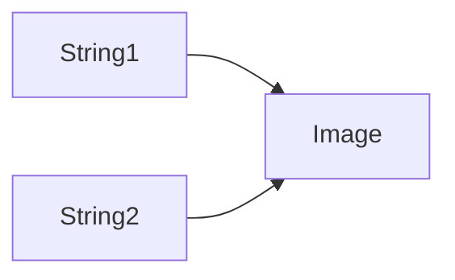

# Elixir Identicon

The goal of this project is to create a simple application that will generate the Github-like logo images, based on the string input. They should be "replicable", meaning once the same input was passed, the same identicon will be generated.

If String1 = String2, we receive the same image

